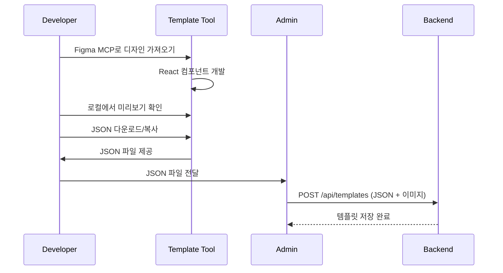
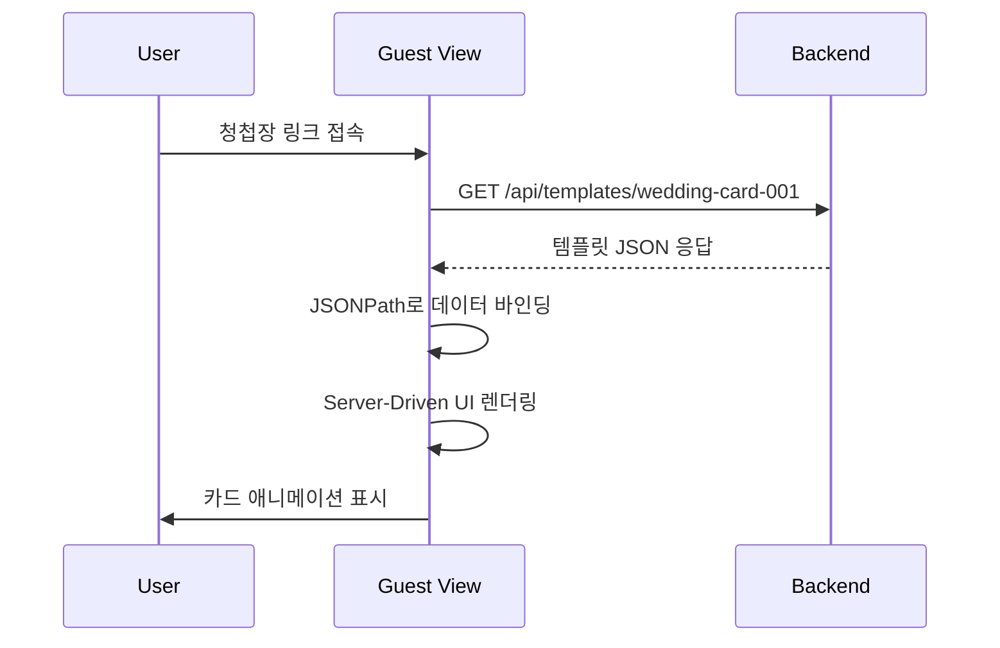
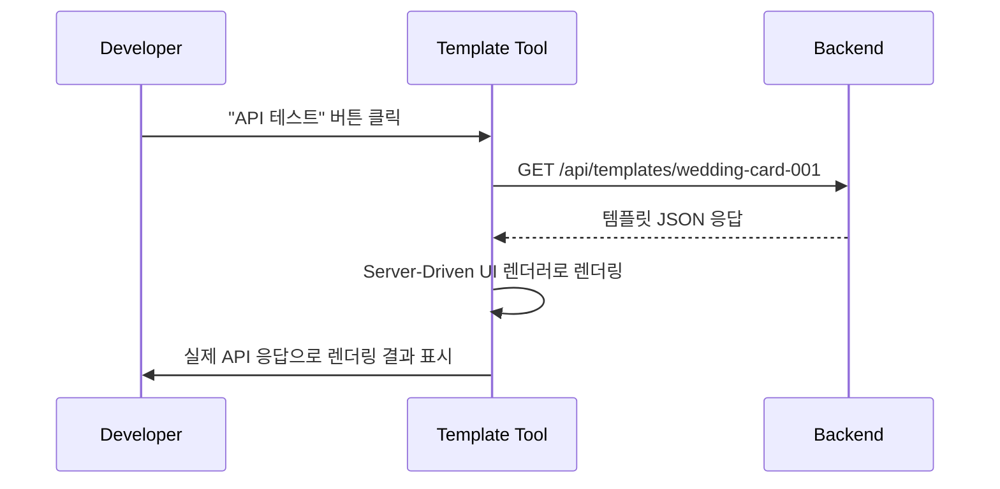

# 📋 Backend API Requirements for Template System

## 개요

이 문서는 **템플릿 개발 도구**에서 생성한 JSON 스키마를 백엔드에 저장하고, **하객뷰 프로젝트**에서 이를 불러와 렌더링하기 위해 백엔드 팀에 요청할 API 명세입니다.

> **중요**: 이 프로젝트는 API를 직접 연동하지 않습니다. JSON 파일을 생성하여 어드민에 수동으로 전달합니다.

## 🎯 전체 워크플로우

```
1. [템플릿 개발 도구 - 이 프로젝트]
   ↓ Figma MCP로 디자인 가져오기
   ↓ 실시간 미리보기하면서 템플릿 개발
   ↓ Server-Driven UI JSON 스키마 생성
   ↓ JSON 파일 다운로드/복사

2. [어드민 (별도 프로젝트)]
   ↓ JSON 받아서 수동으로 등록
   ↓ POST /api/templates (템플릿 JSON + 이미지 저장)

3. [백엔드 API]
   ↓ 템플릿 데이터 저장 및 관리
   ↓ GET /api/templates/{id} (저장된 템플릿 제공)

4. [하객뷰 프로젝트 - 실제 서비스]
   ↓ GET /api/templates/{id} 호출
   ↓ Server-Driven UI 렌더러가 JSON 파싱
   ↓ 사용자에게 청첩장 렌더링
```

## 📦 이 프로젝트의 역할

- ✅ Figma 디자인을 React 컴포넌트로 개발
- ✅ 실시간 미리보기 및 수정
- ✅ Server-Driven UI JSON 스키마 생성
- ✅ JSON 파일 다운로드/복사 기능 제공
- ❌ 백엔드 API 직접 연동 없음 (현재)
- 🔮 향후: 백엔드 API에서 템플릿 불러와 렌더링 테스트 기능 추가 가능

## 🎯 핵심 개념

### Server-Driven UI
- 템플릿 개발 도구에서 생성한 **JSON 스키마**를 백엔드에 저장
- 하객뷰 프로젝트가 백엔드에서 JSON을 불러와 렌더링
- 디자인 변경 시 **앱 배포 없이** 백엔드에서 JSON만 수정

### JSONPath 데이터 바인딩
```json
{
  "data": {
    "wedding": {
      "groom": "이준서",
      "bride": "김은재"
    }
  },
  "components": [{
    "type": "text",
    "content": "$.data.wedding.groom"  // JSONPath로 데이터 참조
  }]
}
```

---

## 📡 백엔드 팀에 요청할 API Endpoints

> **중요**:
> - 이 API는 **어드민 프로젝트**와 **하객뷰 프로젝트**에서 사용됩니다.
> - **이 프로젝트(템플릿 개발 도구)는 API를 직접 호출하지 않습니다.**
> - 사용자별 카드 생성 API(`POST /api/cards`)는 하객뷰 프로젝트의 책임입니다.

### 1. 템플릿 생성/저장 (어드민에서 사용)

```
POST /api/templates
Authorization: Bearer {ADMIN_TOKEN}
Content-Type: application/json
```

**Request:**
```json
{
  "id": "wedding-card-001",
  "version": "2.0.0",
  "name": "웨딩 청첩장 템플릿 001 (절대 픽셀 레이아웃)",
  "description": "Figma 2072:68405 기반, 절대 픽셀 레이아웃 시스템",
  "metadata": {
    "title": "결혼식 초대장",
    "description": "이준서 ❤️ 김은재의 결혼식에 초대합니다",
    "category": "wedding",
    "figmaNodeId": "2072:68405"
  },
  "layout": {
    "baseSize": {
      "width": 335,
      "height": 515
    },
    "groom": {
      "x": 24,
      "y": 395,
      "width": 111,
      "fontSize": 20,
      "fontFamily": "'NanumMyeongjo', serif",
      "color": "#333333",
      "letterSpacing": -0.316,
      "align": "center",
      "zIndex": 2
    }
    // ... 나머지 레이아웃 정의
  },
  "data": {
    "wedding": {
      "groom": "이 준 서",
      "bride": "김 은 재",
      "date": "2038년 10월 12일 토요일 오후 2시",
      "venue": "메종 드 프리미어 그랜드홀",
      "photo": "https://cdn.example.com/photos/sample.jpg",
      "backgroundImage": "https://cdn.example.com/backgrounds/wedding-bg.png",
      "decorationImage": "https://cdn.example.com/decorations/flower.png"
    }
  },
  "components": [
    {
      "id": "wedding-card-main",
      "type": "wedding-card-template-001",
      "data": {
        "groom": "$.data.wedding.groom",
        "bride": "$.data.wedding.bride",
        "date": "$.data.wedding.date",
        "venue": "$.data.wedding.venue",
        "photo": "$.data.wedding.photo",
        "backgroundImage": "$.data.wedding.backgroundImage",
        "decorationImage": "$.data.wedding.decorationImage"
      },
      "layout": "$.layout",
      "style": {
        "width": "335px",
        "height": "515px"
      }
    }
  ]
}
```

**Response:**
```json
{
  "id": "wedding-card-001",
  "version": "2.0.0",
  "message": "Template created successfully",
  "createdAt": "2025-10-17T08:00:00Z"
}
```

---

### 2. 템플릿 목록 조회 (하객뷰 & 어드민에서 사용)

```
GET /api/templates
```

**Response:**
```json
{
  "total": 1,
  "templates": [
    {
      "id": "wedding-card-001",
      "name": "웨딩 청첩장 템플릿 001",
      "version": "2.0.0",
      "description": "Figma 2072:68405 기반, 절대 픽셀 레이아웃 시스템",
      "category": "wedding",
      "thumbnail": "https://cdn.example.com/thumbnails/wedding-001.png",
      "createdAt": "2025-10-17T08:00:00Z",
      "updatedAt": "2025-10-17T08:00:00Z"
    }
  ]
}
```

---

### 3. 템플릿 상세 조회 (하객뷰 & 어드민에서 사용)

```
GET /api/templates/{templateId}
```

**Response:**
```json
{
  "id": "wedding-card-001",
  "version": "2.0.0",
  "name": "웨딩 청첩장 템플릿 001 (절대 픽셀 레이아웃)",
  "description": "Figma 2072:68405 기반, 절대 픽셀 레이아웃 시스템",
  "metadata": {
    "title": "결혼식 초대장",
    "description": "이준서 ❤️ 김은재의 결혼식에 초대합니다",
    "category": "wedding",
    "thumbnail": "https://cdn.example.com/thumbnails/wedding-001.png",
    "figmaNodeId": "2072:68405"
  },
  "layout": {
    "baseSize": {
      "width": 335,
      "height": 515
    },
    "groom": {
      "x": 24,
      "y": 395,
      "width": 111,
      "fontSize": 20,
      "fontFamily": "'NanumMyeongjo', serif",
      "color": "#333333",
      "letterSpacing": -0.316,
      "align": "center",
      "zIndex": 2
    },
    "bride": {
      "x": 193,
      "y": 395,
      "width": 117,
      "fontSize": 20,
      "fontFamily": "'NanumMyeongjo', serif",
      "color": "#333333",
      "letterSpacing": -0.316,
      "align": "center",
      "zIndex": 2
    }
    // ... 나머지 레이아웃 정의
  },
  "data": {
    "wedding": {
      "groom": "이 준 서",
      "bride": "김 은 재",
      "date": "2038년 10월 12일 토요일 오후 2시",
      "venue": "메종 드 프리미어 그랜드홀",
      "photo": "https://cdn.example.com/photos/sample.jpg",
      "backgroundImage": "https://cdn.example.com/backgrounds/wedding-bg.png",
      "decorationImage": "https://cdn.example.com/decorations/flower.png"
    }
  },
  "components": [
    {
      "id": "wedding-card-main",
      "type": "wedding-card-template-001",
      "data": {
        "groom": "$.data.wedding.groom",
        "bride": "$.data.wedding.bride",
        "date": "$.data.wedding.date",
        "venue": "$.data.wedding.venue",
        "photo": "$.data.wedding.photo",
        "backgroundImage": "$.data.wedding.backgroundImage",
        "decorationImage": "$.data.wedding.decorationImage"
      },
      "layout": "$.layout",
      "style": {
        "width": "335px",
        "height": "515px"
      }
    }
  ]
}
```

---

### 4. 템플릿 수정 (어드민에서 사용)

```
PATCH /api/templates/{templateId}
Authorization: Bearer {ADMIN_TOKEN}
Content-Type: application/json
```

**Request:**
```json
{
  "name": "웨딩 청첩장 템플릿 001 (업데이트)",
  "version": "2.1.0",
  "description": "업데이트된 템플릿",
  "layout": {
    // 수정된 레이아웃
  }
}
```

**Response:**
```json
{
  "id": "wedding-card-001",
  "version": "2.1.0",
  "message": "Template updated successfully",
  "updatedAt": "2025-10-17T08:00:00Z"
}
```

---

### 5. 템플릿 삭제 (어드민에서 사용)

```
DELETE /api/templates/{templateId}
Authorization: Bearer {ADMIN_TOKEN}
```

**Response:**
```json
{
  "id": "wedding-card-001",
  "message": "Template deleted successfully",
  "deletedAt": "2025-10-17T08:00:00Z"
}
```

---

### 6. 이미지 업로드 (어드민에서 사용)

```
POST /api/templates/upload
Authorization: Bearer {ADMIN_TOKEN}
Content-Type: multipart/form-data
```

**Request:**
```
file: [binary image data]
type: "photo" | "background" | "decoration" | "thumbnail"
templateId: "wedding-card-001" (optional)
```

**Response:**
```json
{
  "url": "https://cdn.example.com/templates/wedding-card-001/photo_xyz789.jpg",
  "filename": "photo_xyz789.jpg",
  "size": 1048576,
  "mimeType": "image/jpeg",
  "uploadedAt": "2025-10-17T08:00:00Z"
}
```

**사용 예시:**
어드민에서 이미지를 업로드한 후, 반환된 URL을 템플릿 JSON의 `data.wedding.photo` 등에 사용합니다.

> **참고**: 템플릿 개발 도구에서는 로컬 이미지(`/assets/{template-id}/`)를 사용하며, 실제 CDN URL은 어드민에서 업로드 시 생성됩니다.

---

## 🔑 데이터 구조 설명

### Template Schema

| Field | Type | Required | Description |
|-------|------|----------|-------------|
| id | string | ✅ | 템플릿 고유 ID |
| version | string | ✅ | 템플릿 버전 (Semantic Versioning) |
| name | string | ✅ | 템플릿 이름 |
| category | string | ✅ | 템플릿 카테고리 (wedding, birthday 등) |
| thumbnail | string | ✅ | 템플릿 썸네일 이미지 URL |
| figmaNodeId | string | ❌ | Figma 디자인 노드 ID (개발 참고용) |
| **common** | object | ✅ | **공통 리소스** (봉투, 배경 등) |
| common.envelope | object | ✅ | 봉투 관련 에셋 (pattern, seal) |
| common.background | string | ✅ | 전체 배경 이미지 URL |
| layout | object | ✅ | Figma 기반 절대 픽셀 레이아웃 |
| data | object | ✅ | 샘플 데이터 (템플릿 미리보기용) |
| components | array | ✅ | Server-Driven UI 컴포넌트 정의 |

### Component Schema

| Field | Type | Required | Description |
|-------|------|----------|-------------|
| id | string | ✅ | 컴포넌트 ID |
| type | string | ✅ | 컴포넌트 타입 (wedding-card-template-001 등) |
| data | object | ✅ | **JSONPath 표현식**으로 데이터 바인딩 |
| layout | string | ❌ | JSONPath로 레이아웃 참조 ($.layout) |
| style | object | ❌ | 인라인 스타일 |

### JSONPath 바인딩 예시

**중요:** `components[].data` 필드는 **JSONPath 표현식**을 사용합니다!

```json
{
  "data": {
    "wedding": {
      "groom": "홍길동"
    }
  },
  "components": [{
    "type": "text",
    "data": {
      "groom": "$.data.wedding.groom"  // ← JSONPath! 실제 값 아님
    }
  }]
}
```

프론트엔드는 이를 다음과 같이 해석합니다:
1. `"$.data.wedding.groom"` → JSONPath 표현식 인식
2. `data.wedding.groom` 에서 실제 값 추출
3. 렌더링: `"홍길동"`

---

## 🎨 이미지 처리

### CDN URL 구조
```
https://cdn.example.com/
  └── templates/                    # 템플릿 전용 이미지
      └── {templateId}/             # 템플릿별 디렉토리
          ├── backgrounds/
          ├── decorations/
          ├── photos/
          └── thumbnails/
```

> **참고**: 사용자가 업로드하는 이미지는 하객뷰 프로젝트에서 처리하며, 여기서는 템플릿 개발용 이미지만 관리합니다.

### 이미지 최적화
- **사진**: 최대 1200px, JPEG 80% 품질
- **배경**: 최대 2000px, PNG/WebP
- **장식**: 투명 PNG, 최대 500px

---

## 🔒 인증 & 권한

### 인증 방식
```
Authorization: Bearer {JWT_TOKEN}
```

### 권한 체크
- **템플릿 생성/수정/삭제**: 어드민 권한 필수 (Bearer Token)
- **템플릿 조회**: 인증 불필요 (하객뷰 프로젝트에서 자유롭게 조회)
- **이미지 업로드**: 어드민 권한 필수

---

## 📊 응답 코드

| Code | Description |
|------|-------------|
| 200 | 성공 |
| 201 | 생성 성공 |
| 400 | 잘못된 요청 (JSON 스키마 오류 등) |
| 401 | 인증 필요 |
| 403 | 권한 없음 |
| 404 | 리소스 없음 |
| 413 | 파일 크기 초과 |
| 500 | 서버 오류 |

---

## 🚀 템플릿 개발 및 배포 플로우

### 1. 템플릿 개발 도구에서 (이 프로젝트)

1. **Figma 디자인 가져오기**: Figma MCP를 통해 디자인 스펙 추출
2. **템플릿 구현**: React 컴포넌트로 템플릿 개발
3. **실시간 미리보기**: 로컬에서 애니메이션 및 레이아웃 확인
4. **JSON 스키마 생성**: 템플릿을 Server-Driven UI JSON으로 변환
5. **JSON 다운로드/복사**: 생성된 JSON 파일을 어드민에 전달

### 2. 어드민 프로젝트에서

1. **JSON 업로드**: 템플릿 개발 도구에서 받은 JSON 등록
2. **이미지 업로드**: `POST /api/templates/upload`로 이미지 업로드
3. **템플릿 저장**: `POST /api/templates`로 백엔드에 저장
4. **템플릿 관리**: 수정, 삭제, 버전 관리

### 3. 하객뷰 프로젝트에서

1. **템플릿 조회**: `GET /api/templates/{templateId}`
2. **JSONPath 파싱**: `components[].data`의 JSONPath 표현식 추출
3. **데이터 바인딩**: 사용자 데이터를 JSONPath로 매핑
4. **컴포넌트 렌더링**: Server-Driven UI 렌더러가 React 컴포넌트로 변환
5. **레이아웃 적용**: Figma 절대 픽셀 좌표로 배치

---

## 💡 백엔드 구현 체크리스트

### 필수 기능
- [ ] 템플릿 CRUD API (POST, GET, PATCH, DELETE)
- [ ] 이미지 업로드 & CDN 연동
- [ ] JSONPath 표현식 검증
- [ ] 템플릿 버전 관리 (Semantic Versioning)
- [ ] 어드민 인증 시스템 (Bearer Token)

### 선택 기능
- [ ] 템플릿 미리보기 이미지 자동 생성
- [ ] 템플릿 복제 기능
- [ ] 템플릿 버전 히스토리 관리
- [ ] 템플릿 검증 (JSON 스키마 유효성)

---

## 📝 예제 시나리오

### 시나리오 1: 템플릿 개발자가 새 템플릿 만들기



### 시나리오 2: 하객뷰 프로젝트에서 템플릿 렌더링



### 시나리오 3: (향후) 템플릿 개발 도구에서 렌더링 테스트



---

## 🔧 프론트엔드 개발 환경 설정 (템플릿 개발 도구)

### 로컬 개발
```bash
# 템플릿 개발 도구 실행
npm run dev  # http://localhost:3000

# 어드민 기능 개발 시 환경 변수 설정
```

### 환경 변수
```env
# 백엔드 API 엔드포인트 (향후 렌더링 테스트 기능용)
NEXT_PUBLIC_API_BASE_URL=https://api.example.com

# CDN URL (로컬 개발 시에는 사용 안 함)
NEXT_PUBLIC_CDN_BASE_URL=https://cdn.example.com
```

### 현재 구현된 기능
- ✅ Figma MCP 디자인 통합
- ✅ 봉투 열림 애니메이션
- ✅ 웨딩 카드 템플릿 (wedding-card-001)
- ✅ 로컬 미리보기
- ✅ JSON 스키마 파일 (`/public/templates/wedding-card-001.json`)

### 구현 예정 기능
- [ ] JSON 다운로드 버튼 UI
- [ ] JSON 클립보드 복사 기능
- [ ] (향후) 백엔드 API에서 템플릿 불러와 렌더링 테스트
- [ ] (향후) Server-Driven UI 렌더러 검증

---

## 📚 참고 자료

- [JSONPath Syntax](https://goessner.net/articles/JsonPath/)
- [Server-Driven UI Pattern](https://www.judo.app/blog/server-driven-ui/)
- [Next.js API Routes](https://nextjs.org/docs/api-routes/introduction)

---

## 📞 문의

템플릿 개발 도구 또는 백엔드 API 구현 관련 문의사항은 Barunn Technical Office에 연락 주세요.

---

## ✅ 요약

### 이 프로젝트 (템플릿 개발 도구)의 역할

1. ✅ **Figma 디자인을 React 컴포넌트로 개발**
2. ✅ **로컬에서 실시간 미리보기 및 수정**
3. ✅ **Server-Driven UI JSON 스키마 생성**
4. ✅ **JSON 파일 다운로드/복사** (어드민에 전달)
5. ❌ **백엔드 API 직접 연동 없음** (현재)
6. 🔮 **(향후) 백엔드 API에서 템플릿 불러와 렌더링 테스트**

### 각 프로젝트의 책임

| 프로젝트 | 역할 |
|---------|------|
| **템플릿 개발 도구 (이 프로젝트)** | JSON 생성, 로컬 미리보기 |
| **어드민 프로젝트** | JSON 등록, 이미지 업로드, 템플릿 관리 |
| **백엔드 API** | 템플릿 저장/조회/관리 |
| **하객뷰 프로젝트** | 템플릿 렌더링, 사용자 카드 생성 |

**이 프로젝트는 사용자 카드 생성 기능을 포함하지 않습니다.** 사용자별 카드 생성은 하객뷰 프로젝트의 책임입니다.
