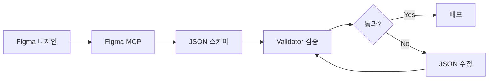

# 🎴 Wedding Card Template 개발 가이드

Figma 디자인부터 SDUI 검증까지 완전한 워크플로우

---

## 📋 목차

1. [프로젝트 소개](#프로젝트-소개)
2. [빠른 시작](#빠른-시작)
3. [전체 워크플로우](#전체-워크플로우)
4. [Step 1: Figma 디자인 준비](#step-1-figma-디자인-준비)
5. [Step 2: JSON 스키마 작성](#step-2-json-스키마-작성)
6. [Step 3: SDUI 검증](#step-3-sdui-검증)
7. [트러블슈팅](#트러블슈팅)
8. [체크리스트](#체크리스트)

---

## 프로젝트 소개

### 🎯 목적
**Server-Driven UI (SDUI)** 기반 웨딩 카드 템플릿 시스템

- **Figma 디자인 → JSON 스키마 → 자동 렌더링**
- 하드코딩된 컴포넌트 없이 JSON만으로 카드 생성
- Validator로 Hardcoded vs SDUI 비교 검증

### 🏗️ 프로젝트 구조

```
envelope-card-animation/
├── public/
│   ├── validator/
│   │   ├── index.html          # ⭐ 템플릿 리스트 (시작점)
│   │   └── detail.html         # ⭐ SDUI 검증 (Hardcoded vs SDUI 비교)
│   ├── templates/
│   │   ├── wedding-card-001.json  # 템플릿 JSON 스키마
│   │   ├── wedding-card-002.json
│   │   ├── wedding-card-003.json
│   │   └── wedding-card-004.json
│   └── assets/
│       ├── common/             # 공통 에셋 (photo, bg, pattern, seal)
│       ├── wedding-card-001/   # 템플릿별 고유 에셋
│       ├── wedding-card-002/
│       ├── wedding-card-003/
│       └── wedding-card-004/
├── components/cards/
│   ├── WeddingCard.tsx         # wedding-card-001 (하드코딩 컴포넌트)
│   ├── WeddingCard002.tsx      # wedding-card-002
│   ├── WeddingCard003.tsx      # wedding-card-003
│   └── WeddingCard004.tsx      # wedding-card-004
└── lib/server-driven-ui/
    └── renderer.tsx            # SDUI 렌더러 (JSON → React)
```

### 🔑 핵심 개념

**1. Server-Driven UI (SDUI)**
- JSON 스키마로 UI 구조와 데이터 정의
- 서버에서 JSON을 내려주면 클라이언트가 동적으로 렌더링
- 앱 업데이트 없이 UI 변경 가능

**2. Hardcoded vs SDUI 검증**
- **Hardcoded**: React 컴포넌트로 직접 작성 (기존 방식)
- **SDUI**: JSON 스키마 기반 자동 렌더링 (새로운 방식)
- **Validator**: 두 방식의 결과가 동일한지 시각적으로 비교

**3. 좌표 시스템**
- **Figma 절대 좌표**: 캔버스 기준 픽셀 값
- **bgOffset**: 배경(BG)의 시작 좌표 (템플릿마다 다름)
- **JSON 저장**: Figma 절대 좌표 그대로 저장
- **렌더링**: Validator가 bgOffset 적용해서 상대 좌표로 변환

---

## 빠른 시작

### 5분 안에 Validator 실행하기

```bash
# 1. 프로젝트 디렉토리로 이동
cd /Users/yujin/Desktop/workplace/envelope-card-animation

# 2. HTTP 서버 시작 (Validator용)
python3 -m http.server 8080

# 3. 브라우저에서 열기
open http://localhost:8080/public/validator/index.html
```

**✅ 확인 사항**
- 템플릿 리스트가 보이는가? (wedding-card-001 ~ 004)
- 각 카드를 클릭하면 detail 페이지로 이동하는가?
- Hardcoded와 SDUI 두 버전이 나란히 보이는가?

---

## 전체 워크플로우



### 프로세스 요약

1. **Figma 디자인 준비** (335×515px)
   - 평평한 레이어 구조 (중첩 금지)
   - 레이어 네이밍 규칙 준수
   - [editable] 태그로 편집 가능 필드 표시

2. **Figma MCP로 메타데이터 추출**
   - 좌표, 크기, 폰트, 색상 자동 추출
   - 이미지 에셋 다운로드

3. **JSON 스키마 작성**
   - `layout`: 요소 위치/크기 (Figma 절대 좌표)
   - `data`: 실제 데이터 (이름, 날짜, 이미지 경로)
   - `components`: SDUI 컴포넌트 정의

4. **Validator로 검증**
   - Hardcoded vs SDUI 비교
   - 레이아웃, 폰트, 색상 일치 여부 확인

5. **검증 통과 시 완료**
   - JSON 스키마가 디자인을 완벽하게 재현
   - 배포 준비 완료

---

## Step 1: Figma 디자인 준비

### 1-1. 템플릿 프레임 생성

**필수 규격**
- **크기**: 335px × 515px (고정)
- **프레임 이름**: `template`
- **배경 요소**: `BG` (필수, 좌표 기준점)

### 1-2. 레이어 구조 규칙

⚠️ **중요: 평평한 레이어 구조 필수!**

**✅ 올바른 구조**
```
template (335×515)
├── BG (background)          ← 좌표 기준점
├── photo
├── groom
├── bride
├── date
├── venue
└── decoration
```

**❌ 잘못된 구조 (중첩 그룹)**
```
template
└── input (Frame)            ← 중간 그룹 사용 금지!
    ├── groom
    └── bride
```

**해결 방법**: 중간 그룹을 선택하고 `Ungroup` (Cmd+Shift+G)

### 1-3. 레이어 네이밍 규칙

**기본 규칙**
- 소문자 + 언더스코어: `photo`, `groom_name`, `date_text`
- JSON 키값과 일치: `groom`, `bride`, `date`, `venue`

**편집 가능 여부 태그**
- **기본값**: `editable: false` (모든 요소는 기본적으로 편집 불가)
- **[editable] 태그**: 사용자 입력 필드만 명시

```
groom [editable]        → JSON: "editable": true
bride [editable]        → JSON: "editable": true
date [editable]         → JSON: "editable": true
venue [editable]        → JSON: "editable": true

photo                   → JSON: editable 필드 없음 (기본값 false)
decoration              → JSON: editable 필드 없음
BG                      → JSON: editable 필드 없음
```

### 1-4. Figma MCP로 메타데이터 추출

```bash
# Claude Code에서 실행
mcp__figma-dev-mode-mcp-server__get_metadata({
  nodeId: "YOUR_NODE_ID"
})
```

**추출 정보**
- 각 요소의 x, y, width, height (절대 좌표)
- fontSize, fontFamily, fontWeight, letterSpacing
- fill 색상 (color)
- BG의 좌표 (bgOffsetX, bgOffsetY)

**예시 출력**
```xml
<frame id="13:263" name="template" x="20" y="148">
  <rounded-rectangle id="2:2" name="BG" x="20" y="148" width="335" height="515" />
  <image id="2:3" name="photo" x="116" y="226" width="144" height="144" />
  <text id="2:4" name="groom" x="20" y="530" width="116" fontSize="18" />
</frame>
```

**bgOffset 확인**
```
BG x="20" y="148"
→ bgOffsetX = 20
→ bgOffsetY = 148
```

---

## Step 2: JSON 스키마 작성

### 2-1. JSON 파일 생성

```bash
touch public/templates/wedding-card-005.json
```

### 2-2. JSON 구조 (v3.0.0)

```json
{
  "id": "wedding-card-005",
  "version": "3.0.0",
  "name": "웨딩 청첩장 템플릿 005",
  "category": "wedding",
  "thumbnail": "/assets/wedding-card-005/card-bg.png",
  "figmaNodeId": "37:456",

  "common": {
    "envelope": {
      "pattern": "/assets/common/pattern.png",
      "seal": "/assets/common/seal.png"
    },
    "background": "/assets/common/bg.png"
  },

  "layout": {
    "baseSize": {
      "width": 335,
      "height": 515
    },
    "background": {
      "type": "background",
      "x": 0,
      "y": 0,
      "width": 335,
      "height": 515,
      "zIndex": 0,
      "editable": false
    },
    "photo": {
      "type": "image",
      "x": 116,              // ← Figma 절대 좌표 (캔버스 기준)
      "y": 226,              // ← Figma 절대 좌표
      "width": 144,
      "height": 144,
      "zIndex": 1,
      "editable": false
    },
    "groom": {
      "type": "text",
      "x": 20,
      "y": 530,
      "width": 116,
      "fontSize": 18,
      "fontFamily": "'NanumMyeongjo', serif",
      "fontWeight": 700,
      "color": "#333333",
      "letterSpacing": -0.2844,
      "align": "right",
      "zIndex": 2,
      "editable": true        // ← [editable] 태그가 있는 필드
    },
    "bride": {
      "type": "text",
      "x": 243,
      "y": 530,
      "width": 112,
      "fontSize": 18,
      "fontFamily": "'NanumMyeongjo', serif",
      "fontWeight": 700,
      "color": "#333333",
      "letterSpacing": -0.2844,
      "align": "left",
      "zIndex": 2,
      "editable": true
    },
    "date": {
      "type": "text",
      "x": 32,
      "y": 582,
      "width": 311,
      "fontSize": 12,
      "fontFamily": "'NanumMyeongjo', serif",
      "color": "#333333",
      "lineHeight": 20,
      "align": "center",
      "zIndex": 2,
      "editable": true
    }
  },

  "data": {
    "wedding": {
      "groom": "이 준 서",
      "bride": "김 은 재",
      "date": "2038년 10월 12일 토요일 오후 2시",
      "venue": "메종 드 프리미어 그랜드홀",
      "photo": "/assets/common/photo.png",
      "backgroundImage": "/assets/wedding-card-005/card-bg.png"
    }
  },

  "components": [
    {
      "id": "wedding-card-main",
      "type": "wedding-card-template-005",
      "data": {
        "groom": "$.data.wedding.groom",
        "bride": "$.data.wedding.bride",
        "date": "$.data.wedding.date",
        "venue": "$.data.wedding.venue",
        "photo": "$.data.wedding.photo",
        "backgroundImage": "$.data.wedding.backgroundImage"
      }
    }
  ]
}
```

### 2-3. 좌표 입력 규칙

**⚠️ 중요: JSON에는 Figma 절대 좌표를 그대로 입력**

```javascript
// Figma 메타데이터
<text id="2:4" name="groom" x="20" y="530" width="116" />

// JSON에 그대로 입력 (변환 X)
"groom": {
  "x": 20,       // ← Figma 절대 좌표 그대로
  "y": 530,      // ← Figma 절대 좌표 그대로
  "width": 116
}
```

**Validator가 자동으로 변환**
- bgOffset 적용: `(x - bgOffsetX, y - bgOffsetY)`
- 백분율 변환: `(상대좌표 / baseSize) * 100%`

### 2-4. Layout Element Type

**필수 필드**
- `type`: 요소 종류 (`text`, `image`, `vector`, `container`, `background`)
- `editable`: 편집 가능 여부 (기본값 `false`)

**Type별 필수 속성**

```json
// text
{
  "type": "text",
  "x": 20,
  "y": 530,
  "fontSize": 18,
  "fontFamily": "'NanumMyeongjo', serif",
  "color": "#333333",
  "align": "center",
  "editable": true
}

// image
{
  "type": "image",
  "x": 116,
  "y": 226,
  "width": 144,
  "height": 144,
  "objectFit": "cover",
  "editable": false
}

// background
{
  "type": "background",
  "x": 0,
  "y": 0,
  "width": 335,
  "height": 515,
  "zIndex": 0,
  "editable": false
}
```

### 2-5. 특수 속성

**centerAlign** (텍스트 중앙 정렬)
```json
"groom": {
  "type": "text",
  "x": 167.5,           // 중앙 x 좌표
  "centerAlign": true,  // transform: translateX(-50%)
  "align": "center"
}
```

**style** (커스텀 스타일, wedding-card-004)
```json
"photo": {
  "type": "image",
  "x": 20,
  "y": 148,
  "style": {
    "width": "103.06%",   // 컨테이너 넘침
    "height": "103.89%",
    "left": "-1.36%",
    "top": "-3.25%"
  }
}
```

---

## Step 3: SDUI 검증

### 3-1. Validator 실행

```bash
# HTTP 서버 시작
python3 -m http.server 8080

# 브라우저에서 열기
open http://localhost:8080/public/validator/index.html
```

### 3-2. 검증 프로세스

**1️⃣ 리스트 페이지** (`index.html`)
- 모든 템플릿 카드 표시
- 버전, SDUI 지원 여부 확인
- 클릭 시 detail 페이지로 이동

**2️⃣ 디테일 페이지** (`detail.html`)
- **좌측**: Hardcoded Component (React 컴포넌트)
- **우측**: SDUI Renderer (JSON 기반)
- **비교 항목**:
  - 텍스트 위치 및 스타일
  - 이미지 위치 및 크기
  - 폰트, 색상, 간격
  - 전체 레이아웃

### 3-3. 검증 통과 기준

**✅ 통과**
- 좌우 렌더링이 시각적으로 동일
- 모든 텍스트가 같은 위치에 표시
- 이미지가 정확히 같은 크기/위치
- 폰트, 색상, 간격이 일치

**❌ 실패**
- 텍스트가 다른 위치에 표시
- 이미지가 잘림/왜곡
- 레이아웃이 깨짐
- Assets 로드 실패 (404)

### 3-4. 검증 도구

**브라우저 DevTools 활용**

1. **Console 로그 확인**
```javascript
🎨 Template ID: wedding-card-005
📊 Layout baseSize: {"width":335,"height":515}
📍 BG offset: {"x":20,"y":148}
🔍 Rendering text: groom, Value: 이 준 서
🔍 Rendering image: photo, Source: /public/assets/common/photo.png
```

2. **Network 탭 확인**
- Assets 로드 확인: `/assets/wedding-card-005/card-bg.png`
- 404 에러 확인: 파일 경로 문제
- 로드 시간 확인: 이미지 최적화 필요 여부

3. **Elements 탭 확인**
- 요소의 실제 CSS 스타일 확인
- Computed 값 확인 (백분율 변환 결과)

### 3-5. bgOffset 매핑

**Validator가 자동 적용하는 bgOffset**

| 템플릿 | bgOffsetX | bgOffsetY |
|--------|-----------|-----------|
| wedding-card-001 | 0 | 0 |
| wedding-card-002 | 20 | 148 |
| wedding-card-003 | 20 | 148 |
| wedding-card-004 | 20 | 148 |

**새 템플릿 추가 시**
1. Figma MCP로 BG 좌표 확인
2. `detail.html`의 `bgOffsets` 객체에 추가

```javascript
// public/validator/detail.html
const bgOffsets = {
  'wedding-card-001': { x: 0, y: 0 },
  'wedding-card-002': { x: 20, y: 148 },
  'wedding-card-003': { x: 20, y: 148 },
  'wedding-card-004': { x: 20, y: 148 },
  'wedding-card-005': { x: 20, y: 148 }  // ← 추가
};
```

---

## 트러블슈팅

### 문제 1: 레이아웃이 밑으로 내려감

**증상**
- 모든 요소가 예상보다 아래에 표시
- Hardcoded와 SDUI 위치가 다름

**원인**
- bgOffset이 잘못 설정됨

**해결**
```bash
# 1. Figma MCP로 BG 좌표 재확인
mcp__figma-dev-mode-mcp-server__get_metadata({ nodeId: "YOUR_ID" })

# 2. BG의 x, y 좌표 확인
<rounded-rectangle id="2:2" name="BG" x="20" y="148" />

# 3. detail.html의 bgOffsets 수정
'wedding-card-005': { x: 20, y: 148 }
```

### 문제 2: 텍스트가 겹침

**증상**
- 신랑/신부 이름이 같은 위치에 표시

**원인**
- `align: "center"`를 위치 정렬로 오해
- `centerAlign` 속성 누락

**해결**
```json
// ❌ 잘못된 예
"groom": {
  "x": 167.5,
  "align": "center"  // 텍스트 정렬일 뿐, 위치는 x 좌표 따름
}

// ✅ 올바른 예 (중앙 정렬이 필요한 경우)
"groom": {
  "x": 167.5,
  "centerAlign": true,  // transform: translateX(-50%)
  "align": "center"
}

// ✅ 올바른 예 (좌/우 정렬)
"groom": {
  "x": 20,
  "align": "right"  // 텍스트만 우측 정렬
}
```

### 문제 3: 이미지가 안 보임

**증상**
- 이미지 영역이 비어 있음
- Console에 404 에러

**해결**
1. **파일 경로 확인**
```bash
ls -la public/assets/wedding-card-005/card-bg.png
```

2. **JSON 경로 확인**
```json
"data": {
  "wedding": {
    "backgroundImage": "/assets/wedding-card-005/card-bg.png"
                      // ↑ 앞에 / 있어야 함
  }
}
```

3. **Validator 경로 prefix 확인**
```javascript
// detail.html에서 /public 자동 추가
const imgSrc = '/public' + weddingData[key];
```

### 문제 4: SVG가 표시 안 됨

**증상**
- SVG 파일이 로드되지만 내용이 안 보임

**원인**
- Figma MCP가 CSS 변수로 색상 지정

**해결**
```bash
# SVG 파일 확인
cat public/assets/wedding-card-005/decoration.svg

# CSS 변수 확인
# ❌ <circle fill="var(--fill-0, #C0B7A8)"/>

# 직접 색상으로 변경
# ✅ <circle fill="#C0B7A8"/>

# 자동 변경 (선택)
sed -i '' 's/var(--fill-0, \(#[0-9A-Fa-f]\{6\}\))/\1/g' public/assets/wedding-card-005/*.svg
```

### 문제 5: Validator 무한 로딩

**증상**
- detail.html에서 스피너만 돌고 렌더링 안 됨

**원인**
- JavaScript 문법 에러 (template literal 이스케이프)

**해결**
```javascript
// ❌ 잘못된 코드
imgStyleOverride = \`width: \${element.style.width};\`;

// ✅ 올바른 코드
imgStyleOverride = 'width: ' + (element.style.width || '100%') + '; ';
```

### 문제 6: 빠진 요소가 있음

**증상**
- Hardcoded에는 보이지만 SDUI에는 없음

**원인**
- JSON에 layout 정의 누락

**해결**
```json
// wedding-card-002 예시
"layout": {
  // ❌ 빠진 요소
  // "dday": { ... }

  // ✅ 추가
  "dday": {
    "type": "text",
    "x": 33,
    "y": 164,
    "width": 310,
    "fontSize": 20,
    "align": "right"
  }
}
```

---

## 체크리스트

### ✅ Figma 디자인
- [ ] 템플릿 크기: 335px × 515px
- [ ] 평평한 레이어 구조 (중첩 그룹 없음)
- [ ] 모든 레이어가 template 바로 아래에 배치
- [ ] 레이어 이름: 소문자 + 언더스코어
- [ ] JSON 키값과 레이어 이름 일치
- [ ] [editable] 태그 적용 (사용자 입력 필드만)
- [ ] BG 레이어 존재 (좌표 기준점)
- [ ] Node ID 확인 및 기록

### ✅ Figma MCP
- [ ] 메타데이터 추출 완료
- [ ] BG 좌표 확인 (bgOffsetX, bgOffsetY)
- [ ] 모든 요소의 좌표/크기 확인
- [ ] 이미지 에셋 다운로드
- [ ] SVG CSS 변수 제거

### ✅ JSON 스키마
- [ ] 파일 생성: `public/templates/wedding-card-XXX.json`
- [ ] version: "3.0.0"
- [ ] layout.baseSize 정의
- [ ] layout.background 정의
- [ ] 모든 요소에 type 필드 추가
- [ ] editable 필드 올바르게 설정 (기본값 false)
- [ ] Figma 절대 좌표 그대로 입력
- [ ] data.wedding에 샘플 데이터 추가
- [ ] components 섹션 정의

### ✅ Assets
- [ ] 폴더 생성: `public/assets/wedding-card-XXX/`
- [ ] card-bg.png 준비
- [ ] 기타 에셋 준비 (decoration, divider 등)
- [ ] 공통 에셋 확인: `/assets/common/photo.png`
- [ ] 이미지 최적화 (WebP, 압축)

### ✅ Validator 설정
- [ ] detail.html의 bgOffsets 매핑 추가
- [ ] HTTP 서버 실행 (port 8080)
- [ ] index.html에서 템플릿 로드 확인
- [ ] detail.html에서 Hardcoded vs SDUI 비교

### ✅ 검증
- [ ] Hardcoded와 SDUI 시각적으로 동일
- [ ] 모든 텍스트 위치 일치
- [ ] 이미지 로드 및 위치 일치
- [ ] 폰트, 색상, 간격 일치
- [ ] Assets 404 에러 없음
- [ ] Console 에러 없음

---

## 추가 리소스

### 📚 관련 문서
- [CLAUDE.md](./CLAUDE.md) - Claude Code 프로젝트 설정 및 개발 규칙
- [DESIGN_GUIDE.md](./DESIGN_GUIDE.md) - Figma 디자인 상세 가이드
- [API_SPEC.md](./API_SPEC.md) - API 명세서

### 🔧 주요 파일
- [public/validator/detail.html](./public/validator/detail.html) - SDUI 검증 페이지
- [types/card-layout.ts](./types/card-layout.ts) - 레이아웃 타입 정의
- [lib/layout-utils.ts](./lib/layout-utils.ts) - 좌표 변환 유틸리티

### 🎓 학습 순서
1. **TEMPLATE_GUIDE.md** (이 문서) - 전체 워크플로우 이해
2. **Validator 실습** - 기존 템플릿 검증해보기
3. **JSON 스키마 수정** - 간단한 값 변경해보기
4. **새 템플릿 추가** - 전체 프로세스 실습

---

## 자주 묻는 질문

### Q1. Validator는 왜 필요한가요?
**A:** JSON 스키마만으로 Hardcoded 컴포넌트와 동일한 결과를 낼 수 있는지 검증하기 위해서입니다. SDUI의 핵심은 "JSON만으로 완전한 UI 재현"이므로, 시각적 비교가 필수입니다.

### Q2. bgOffset은 어떻게 찾나요?
**A:** Figma MCP로 메타데이터를 추출하면 BG 레이어의 x, y 좌표가 나옵니다. 그것이 bgOffset입니다.

```xml
<rounded-rectangle id="2:2" name="BG" x="20" y="148" />
→ bgOffsetX = 20, bgOffsetY = 148
```

### Q3. 왜 JSON에 Figma 절대 좌표를 그대로 입력하나요?
**A:**
1. 디자이너가 Figma 값을 바로 사용할 수 있어 편리
2. 좌표 변환 로직을 Validator에 집중
3. JSON이 Figma의 "진실 공급원(Source of Truth)"이 됨

### Q4. editable 필드는 언제 사용하나요?
**A:**
- **editable: true**: 사용자가 입력하는 필드 (이름, 날짜, 장소)
- **editable 없음 (기본값 false)**: 디자인 요소 (배경, 사진, 장식)

### Q5. Hardcoded 컴포넌트는 왜 필요한가요?
**A:** 검증 기준점(Ground Truth)으로 사용합니다. Hardcoded가 완벽하게 작동하면, SDUI가 그것을 100% 재현해야 합니다.

### Q6. 새 템플릿을 추가하려면 어떻게 하나요?
**A:**
1. Figma 디자인 준비 (335×515px, 평평한 구조)
2. Figma MCP로 메타데이터 추출
3. JSON 스키마 작성 (`wedding-card-005.json`)
4. `detail.html`에 bgOffset 매핑 추가
5. Validator로 검증

### Q7. 프로젝트를 어떻게 사용하나요?
**A:**
```bash
# 1. Validator 실행
python3 -m http.server 8080
open http://localhost:8080/public/validator/index.html

# 2. 템플릿 선택 (wedding-card-001 ~ 004)

# 3. Hardcoded vs SDUI 비교

# 4. 통과하면 JSON 스키마 완성!
```

---

**💡 시작하기**

```bash
# 지금 바로 Validator 실행해보세요!
cd /Users/yujin/Desktop/workplace/envelope-card-animation
python3 -m http.server 8080
open http://localhost:8080/public/validator/index.html
```
